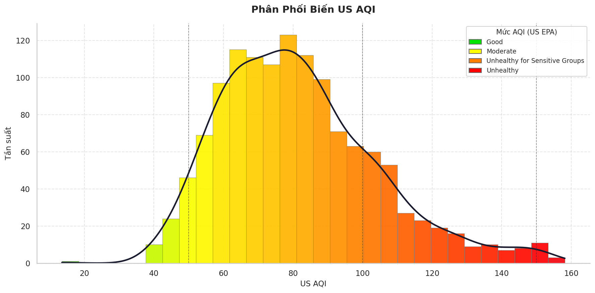
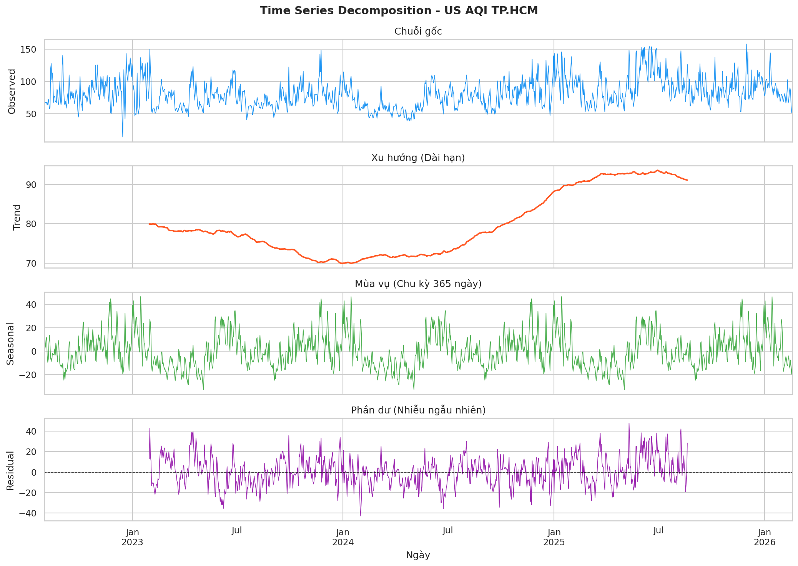
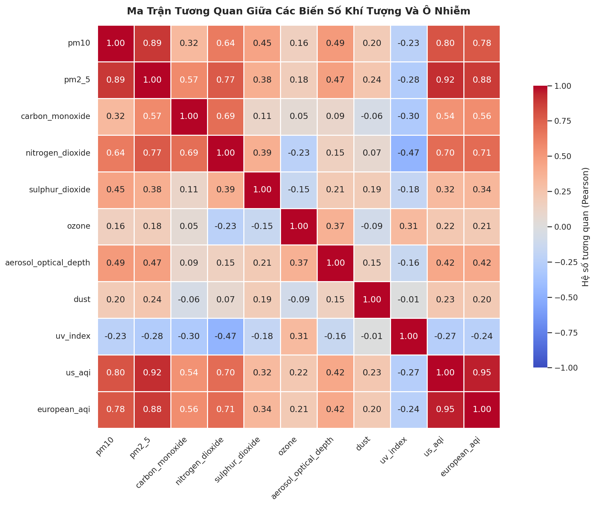
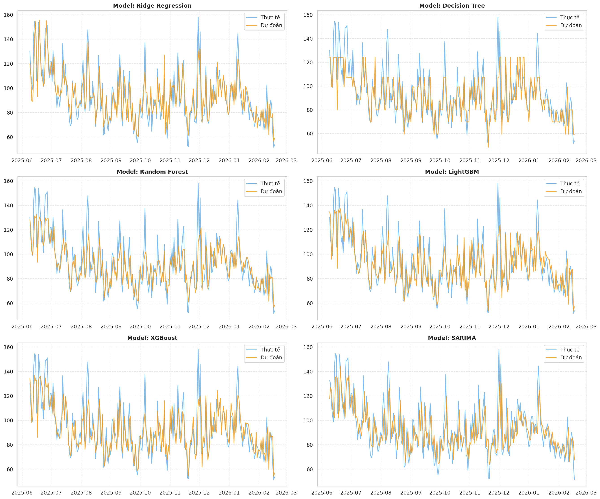

# Dự đoán chất lượng không khí ngày hôm sau tại TP.HCM

Mini project môn Nhập môn Khoa học Dữ liệu

Nhóm 6:
  - Trần Đình Tuấn - Nhóm trưởng
  - Phạm Minh Duy - Thành viên
  - Lê Phạm Thế Phú - Thành viên
  - Trần Phan Nhật Trường - Thành viên
  - Lê Viết Khánh Đạt - Thành viên
  - Phạm Minh Khoa - Thành viên

## Tổng quan
Dự án này xây dựng một hệ thống dự đoán chỉ số AQI (Air Quality Index) cho thành phố Hồ Chí Minh vào ngày tiếp theo bằng các phương pháp học máy. Mục tiêu chính là hỗ trợ nhận diện xu hướng ô nhiễm không khí và cung cấp cảnh báo sớm cho người dân cũng như cơ quan quản lý môi trường.

Project gồm 3 thành phần chính:
- Phân tích và tiền xử lý dữ liệu
- Huấn luyện và đánh giá các mô hình dự đoán
- Trực quan hóa kết quả thông qua dashboard và biểu đồ minh họa

## Mục tiêu của dự án
- Xây dựng pipeline xử lý dữ liệu chuỗi thời gian phù hợp với bài toán dự báo AQI.
- Tạo các đặc trưng hữu ích như lag features, rolling statistics và feature theo thời gian.
- So sánh hiệu năng của nhiều mô hình hồi quy và phân loại.
- Đánh giá mô hình bằng các chỉ số MAE, RMSE, R² và MAPE.
- Cung cấp một hệ thống có thể chạy được local và có thể mở rộng về sau.

## Dữ liệu sử dụng
Dự án sử dụng dữ liệu lịch sử về chất lượng không khí và các biến liên quan để huấn luyện mô hình dự đoán AQI.

Các file dữ liệu chính:
- [data/air_quality_historical.csv](data/air_quality_historical.csv) - dữ liệu lịch sử về AQI và các chỉ số môi trường.
- [data/city_info.csv](data/city_info.csv) - thông tin về thành phố và các thuộc tính liên quan.
- [data/data_dictionary.csv](data/data_dictionary.csv) - bảng mô tả các cột dữ liệu.

## Quy trình thực hiện
### 1. Khám phá dữ liệu (EDA)
Sau khi phân tích dữ liệu, nhóm đã quan sát được xu hướng biến động của AQI theo thời gian, mức độ phân bố và mối liên hệ giữa các biến môi trường.

Một số hình ảnh minh họa từ quá trình EDA:







### 2. Tiền xử lý và feature engineering
Các bước chính bao gồm:
- xử lý giá trị thiếu
- tạo target cho bài toán dự đoán ngày tiếp theo
- tạo các feature như lag, rolling mean/std/min/max
- thêm các feature thời gian như tháng, ngày trong tuần, mùa

### 3. Huấn luyện mô hình
Nhóm đã thử nghiệm nhiều mô hình khác nhau cho bài toán hồi quy và phân loại, bao gồm:
- Ridge Regression
- Decision Tree
- Random Forest
- LightGBM
- XGBoost
- Các mô hình phân loại để chuyển AQI thành các nhãn mức độ ô nhiễm

### 4. Đánh giá mô hình
Các chỉ số chính được sử dụng để so sánh là:
- MAE
- RMSE
- R²
- MAPE

## Kết quả đạt được
Theo thông tin lưu trong [models/metadata.json](models/metadata.json), mô hình được chọn làm mô hình chính hiện tại là Ridge Regression với các chỉ số đánh giá như sau:

| Metric | Giá trị |
|---|---:|
| MAE | 8.27 |
| RMSE | 10.78 |
| R² | 0.75 |
| MAPE | 8.86 |

Mô hình này được huấn luyện với 40 feature đầu vào và mục tiêu là dự đoán giá trị AQI ngày tiếp theo.

### Minh họa kết quả mô hình





## Cấu trúc thư mục
```text
Air_Quality_Prediction_For_The_Next_Day_In_Ho_Chi_Minh_City-main/
├── data/                
├── figures/             
├── models/              
├── notebooks/           
├── outputs/             
├── dashboard.py        
├── predict.py          
├── requirements.txt     
├── README.md            
└── LICENSE
```

### Chú thích các nhánh chính
- data/: chứa dữ liệu đầu vào cho dự án.
- figures/: lưu các biểu đồ EDA, kết quả mô hình và SHAP.
- models/: lưu mô hình huấn luyện và metadata để dashboard sử dụng.
- notebooks/: chứa toàn bộ quy trình phân tích và thử nghiệm mô hình.
- outputs/: lưu tập dữ liệu đã xử lý cùng kết quả đánh giá.
- dashboard.py: triển khai dashboard trực quan hóa.
- predict.py: chạy dự đoán AQI cho ngày tiếp theo.

## Hướng dẫn chạy dự án
### 1. Cài đặt môi trường
```bash
python -m venv .venv
source .venv/bin/activate   # macOS/Linux
.venv\Scripts\activate      # Windows
pip install -r requirements.txt
```

### 2. Chạy notebook
Mở các file notebook trong thư mục [notebooks](notebooks) để xem toàn bộ quy trình phân tích, tiền xử lý và huấn luyện mô hình.

### 3. Chạy script dự đoán
```bash
python predict.py
```
Script này sẽ:
- gọi dữ liệu hiện tại từ API
- tạo feature cho ngày tiếp theo
- dự đoán AQI
- phân loại mức độ ô nhiễm
- lưu kết quả vào thư mục [outputs](outputs)

### 4. Chạy dashboard
```bash
python dashboard.py
```
Sau đó mở trình duyệt tại địa chỉ:
```text
http://localhost:8050
```

## Tính năng nổi bật
- Dự đoán AQI cho ngày tiếp theo
- Phân loại mức ô nhiễm không khí thành các lớp rõ ràng
- Trực quan hóa dữ liệu và kết quả mô hình bằng biểu đồ
- Có thể mở rộng thêm dữ liệu thời tiết và các biến ngoại cảnh để cải thiện độ chính xác

## Hướng phát triển tiếp theo
- Bổ sung dữ liệu thời tiết để tăng độ chính xác
- Thử nghiệm thêm các mô hình thời gian như SARIMA, LSTM hoặc Transformer
- Tối ưu tham số mô hình và xây dựng hệ thống cảnh báo tự động
- Kết nối dashboard với dữ liệu cập nhật theo thời gian thực

## Tài liệu tham khảo
- Dataset chất lượng không khí TP.HCM
- Các thư viện hỗ trợ: pandas, scikit-learn, xgboost, lightgbm, plotly, dash, shap

## License
Dự án này được sử dụng cho mục đích học tập và minh họa trong môn Nhập môn Khoa học Dữ liệu.
